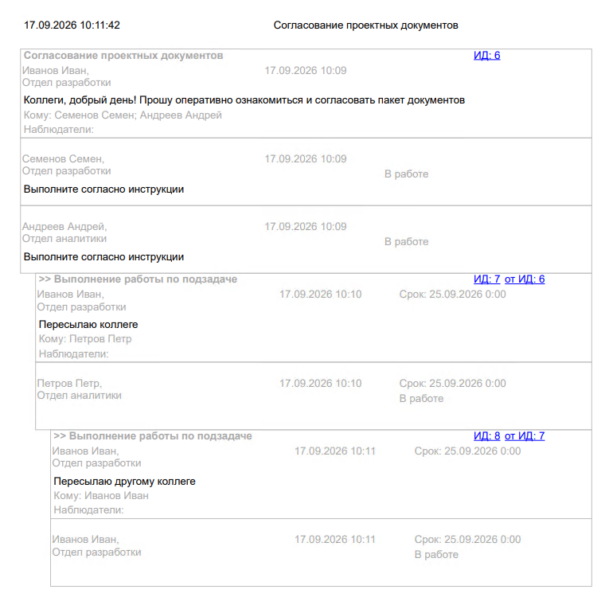

# Иерархический отчет «История переписки по задаче»
Репозиторий с шаблоном разработки «История переписки по задаче».

Шаблон разрабатывался для версии Directum RX 4.12. Совместимость на версиях ранее 4.12 не гарантируется, может потребоваться доработка решения.

## Описание
Шаблон предоставляет возможность сформировать отчет, содержащий переписку в рамках задачи – функциональность, аналогичная действию «Печать переписки». 

Целью реализации шаблона являлось предоставить возможность формирования истории переписки по задаче на стороне сервера, так как на текущий момент действие Directum RX «Печать переписки» вызывается и формирует pdf-файл только на стороне клиента. 

Визуальное представление формируемого отчета упрощено по сравнению с отчетом, формируемым действием «Печать переписки». При необходимости оформление отчета может быть доработано.

Максимальное количество уровней иерархии, предусмотренное шаблоном для визуального отображения, — 10. Если задача содержит подзадачи, расположенные на уровнях иерархии 10 и ниже, они попадут в отчет, однако все будут отображаться как 10-й уровень. Для визуального отображения более 10 уровней иерархии переписки потребуется доработка шаблона.

> [!NOTE]
> Формирование отчета является ресурсоемкой операцией из-за использования вложенных циклов при обработке запусков задач, подзадач и их заданий.
> При большом объеме данных или увеличении максимального уровня иерархии - время его формирования может возрастать.

Шаблон позволяет формировать переписку независимо от типа задачи или задания. Для формирования отчета необходимо передать в шаблон задачу, по которой требуется сформировать переписку:

```
var historyReport = HistoryReport.Reports.GetHierarchyReport();
historyReport.Task = /*задача*/;
historyReport.Open();
```


## Апробация на проектах
Реализованная функциональность была использована на проектах:
*	Использование на проектах внедрения Directum RX для клиентов в банковском секторе - 2 проекта;

## Состав решения
1.	Модуль «Отчет с историей переписки» (HistoryReport).
2.	Отчет «История переписки» (HierarchyReport).

> [!NOTE]
> Замечания и пожеланию по развитию шаблона разработки фиксируйте через [Issues](https://github.com/AkelonDev/HierarchyReport/issues).
При оформлении ошибки, опишите сценарий для воспроизведения. Для пожеланий приведите обоснование для описываемых изменений - частоту использования, бизнес-ценность, риски и/или эффект от реализации.
> 
> Внимание! Изменения будут вноситься только в новые версии.

## Порядок установки
Для работы требуется:
1. Установленный Directum RX версии 4.12 и выше. 

### Установка для ознакомления
1. Склонировать репозиторий с HierarchyReport в папку.
2. Указать в config.yml в разделе DevelopmentStudio:
```xml
   GIT_ROOT_DIRECTORY: '<Папка из п.1>'
   REPOSITORIES:
      repository:
      -   '@folderName': 'work'
          '@solutionType': 'Work'
          '@url': https://github.com/AkelonDev/HierarchyReport.git'
      -   '@folderName': 'base'
          '@solutionType': 'Base'
          '@url': ''
```

### Установка для использования на проекте

Возможные варианты:

#### A. Fork репозитория.
1. Сделать fork репозитория HierarchyReport для своей учетной записи.
2. Склонировать созданный в п. 1 репозиторий в папку.
3. Указать в config.yml в разделе DevelopmentStudio:
```xml
   GIT_ROOT_DIRECTORY: '<Папка из п.2>'
   REPOSITORIES:
      repository:
      -   '@folderName': 'work'
          '@solutionType': 'Work'
          '@url': https://github.com/AkelonDev/HierarchyReport.git'
      -   '@folderName': 'base'
          '@solutionType': 'Base'
          '@url': ''
```

#### B. Подключение на базовый слой.
Вариант не рекомендуется, так как при выходе версии шаблона разработки не гарантируется обратная совместимость.
1. Склонировать репозиторий HierarchyReport в папку.
2. Указать в config.yml в разделе DevelopmentStudio:
```xml
   GIT_ROOT_DIRECTORY: '<Папка из п.1>'
   REPOSITORIES:
      repository:
      -   '@folderName': 'work'
          '@solutionType': 'Work'
          '@url': '<Адрес репозитория для рабочего слоя>'
      -   '@folderName': 'base'
          '@solutionType': 'Base'
          '@url': ''
      -   '@folderName': 'base'
          '@solutionType': 'Base'
          '@url': 'https://github.com/AkelonDev/HierarchyReport.git'
```

#### C. Копирование репозитория в систему контроля версий.
Рекомендуемый вариант для проектов внедрения.
1. В системе контроля версий с поддержкой git создать новый репозиторий.
2. Склонировать репозиторий HierarchyReport в папку с ключом `--mirror`.
3. Перейти в папку из п. 2.
4. Импортировать клонированный репозиторий в систему контроля версий командой:
`git push –mirror <Адрес репозитория из п. 1>`


